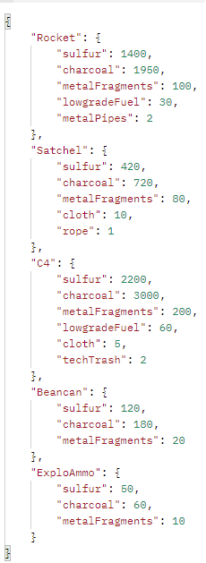

Jag har byggt ett API med 5st endpoints med base API endpoint: https://cscloud7-246.lnu.se/rust-raid-calc/ 
/costAll - GET - no parameters 
/cost - POST - 2 parameters. Item, amount. Example: Satchen, 3 
/buildCost - POST - 1 parameter. Grade. Example: Stone 
/raidCheapestWay - POST - 1 parameter. Grade. Example: Metal 
/raidFastestWay - POST - 1 parameter. Grade. Example: Wood 
 
I repot finns det en fil som heter 'exampleApp.js' där alla API endpoints demonstreras att dom fungerar. 

Example on endpoint /costALL below

